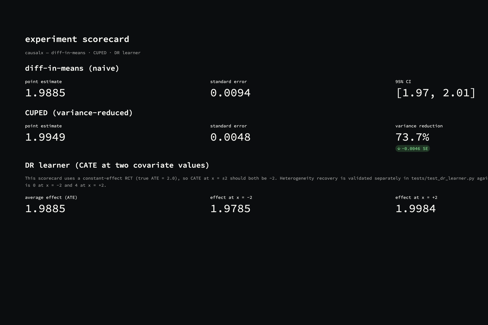
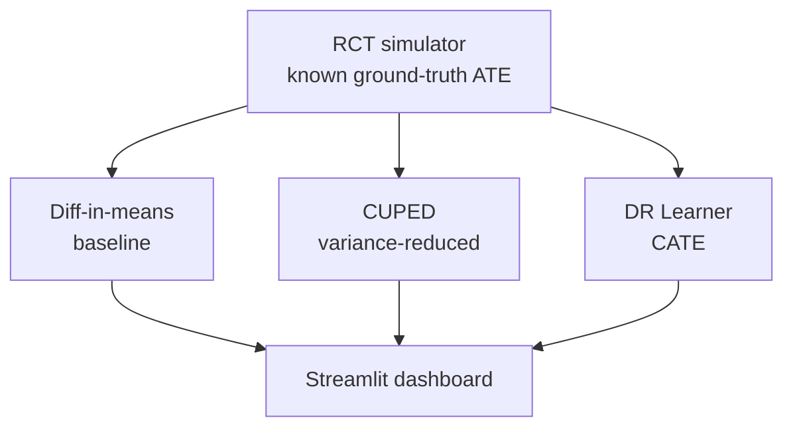

# causalx

Simulation-first toolkit for estimating treatment effects from randomized experiments. Every estimator is checked against data with a **known, controllable ground truth** before it is trusted.

[](https://github.com/Dheeraj1412/causal-experimentation-platform/actions/workflows/tests.yml)
[](https://www.python.org/downloads/)
[](LICENSE)



## Quick start

Requires [uv](https://docs.astral.sh/uv/) and Python 3.11+.

```bash
git clone https://github.com/Dheeraj1412/causal-experimentation-platform.git
cd causal-experimentation-platform
uv sync
uv run pytest -v
uv run streamlit run dashboard/app.py
```

The dashboard is **local only** (`http://localhost:8501`). There is no public deployment yet.

Minimal Python usage:

```python
from causalx import simulate_experiment, diff_in_means, cuped

df = simulate_experiment(n_units=200_000, true_ate=2.0, pre_period_corr=0.6, seed=1)
print(diff_in_means(df))
print(cuped(df)["variance_reduction_pct"])
```

## What's implemented

| Component | Description | Status |
|---|---|---|
| **Simulator** | RCT data generator with controllable ATE, pre-period correlation, and effect heterogeneity | done |
| **Diff-in-means** | Baseline estimator — point estimate, standard error, 95% CI | done |
| **CUPED** | Variance-reduction via pre-treatment covariate adjustment | done |
| **DR Learner** | Heterogeneous treatment effects (CATE) via EconML, doubly-robust | done |
| **Dashboard** | Local Streamlit scorecard (dark theme) | done |
| **CI** | GitHub Actions runs `uv run pytest -v` | done |
| mSPRT sequential testing | Always-valid p-values under continuous monitoring | planned |
| Power / sample-size calculator | | planned |
| FastAPI service | `/estimate`, `/power` endpoints | planned |
| Docker | Containerization | planned |
| Public deployment | Hugging Face Spaces | planned |

## Results

Figures below are from `simulate_experiment(n_units=200_000, true_ate=2.0, pre_period_corr=0.6, seed=1)` unless noted. Reproduce with the snippets in [Validation](#validation).

### Diff-in-means (baseline)

| Metric | Value |
|---|---|
| Point estimate | 1.9885 |
| 95% CI | [1.9701, 2.0068] |
| Empirical CI coverage (200 independent trials, n=5,000 each) | 92.5% (test allows 90–100%; nominal 95%) |

### CUPED (variance reduction)

Same dataset, using a pre-treatment covariate correlated at ρ=0.6:

| Metric | Diff-in-means | CUPED |
|---|---|---|
| Standard error | 0.0094 | 0.0048 |
| **Variance reduction** | — | **73.7%** (target: ≥30%) |

### DR Learner (heterogeneous effects)

This table is **not** from the constant-effect RCT above. It uses the hand-built DGP in `tests/test_dr_learner.py` (true effect = `2 + covariate_x`, so 0.0 at x=-2 and 4.0 at x=+2):

| | True effect | DR Learner estimate |
|---|---|---|
| At covariate x = -2 | 0.0 | -0.04 |
| At covariate x = +2 | 4.0 | 4.05 |

On the constant-effect RCT used by the dashboard, CATE at x=±2 is both ~2.0, as it should be.

## Why simulation-first?

You can never observe a real experiment's true causal effect — only estimate it. Before trusting any estimator on real data, this project checks it against a synthetic data-generating process where the true effect is known. If an estimator cannot recover a known truth in a world we fully control, it should not be trusted where the truth is unknown.

## Architecture

What the repo actually does today: a simulator with known ground truth, three estimators, and a local Streamlit scorecard. There is no ingestion pipeline, schema validator, or leakage checker yet.



## Project structure

```
src/causalx/
├── simulate.py                    # RCT simulator with known ground truth
└── estimators/
    ├── diff_in_means.py
    ├── cuped.py
    └── dr_learner.py

dashboard/
└── app.py                         # Local Streamlit scorecard

tests/                             # pytest; run with `uv run pytest -v`
├── test_simulate.py
├── test_diff_in_means.py
├── test_cuped.py
└── test_dr_learner.py
```

## Validation

```bash
uv run pytest -v
```

Reproduce the tables (same seeds as above):

```python
from causalx import simulate_experiment, diff_in_means, cuped, dr_learner
import numpy as np
import pandas as pd

df = simulate_experiment(n_units=200_000, true_ate=2.0, pre_period_corr=0.6, seed=1)
print(diff_in_means(df))
print(cuped(df))

rng = np.random.default_rng(1)
n = 20_000
x = rng.normal(0, 1, n)
t = rng.binomial(1, 0.5, n)
tau = 2.0 + x
y = 5.0 + 0.5 * x + t * tau + rng.normal(0, 1, n)
model = dr_learner(pd.DataFrame({"outcome": y, "treatment": t, "covariate_x": x}))["model"]
print(model.effect(np.array([[-2.0]]))[0], model.effect(np.array([[2.0]]))[0])
```

## Validity assumptions

Diff-in-means and CUPED require **proper randomization** — treatment assignment independent of potential outcomes. Breaking that in the same DGP (assign `treatment = 1{covariate_x > 0}` instead of a coin flip) yields a biased estimate of **4.22** vs true ATE 2.0 at n=200,000 (`seed=1`), and the bias does not vanish at larger n. That check lives in `tests/test_diff_in_means.py`.

DR Learner is doubly robust: it remains unbiased if either its propensity model or its outcome model is approximately correct. That is a property of the method, not something this repo separately proves on observational data.

## Roadmap

- mSPRT sequential testing for always-valid inference under continuous monitoring
- Power / sample-size calculator
- FastAPI service exposing estimators via `/estimate` and `/power`
- Docker image
- Public dashboard on Hugging Face Spaces
- Publish the package to TestPyPI

## Tech stack

Python 3.11 · pandas · numpy · [EconML](https://github.com/py-why/EconML) · scikit-learn · Streamlit · pytest · uv

## License

MIT. See [LICENSE](LICENSE).
